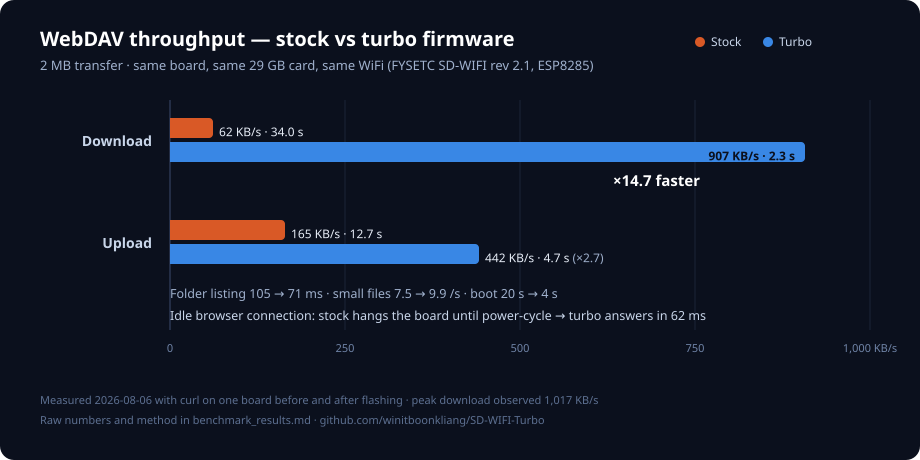
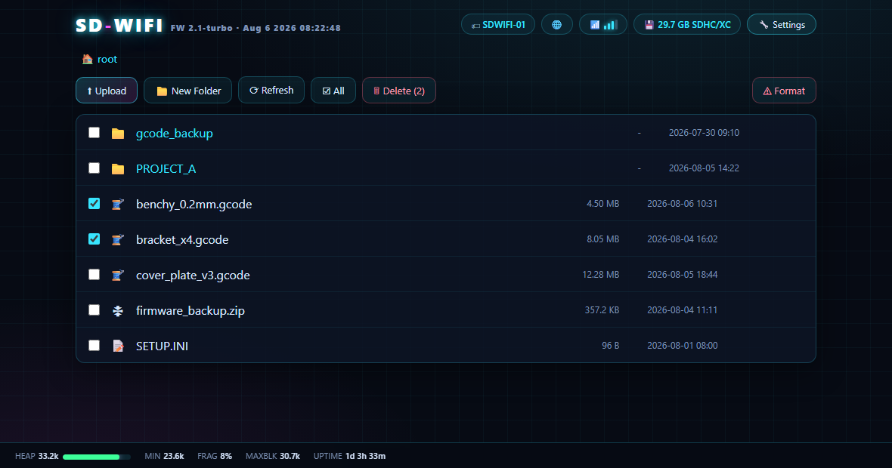
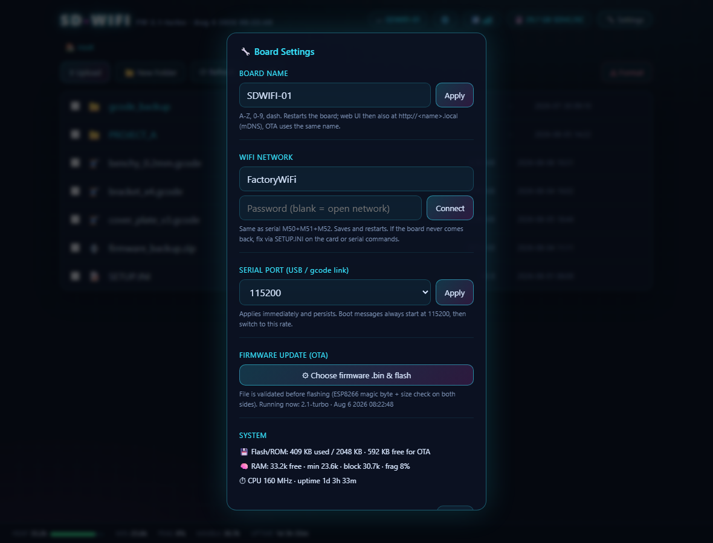
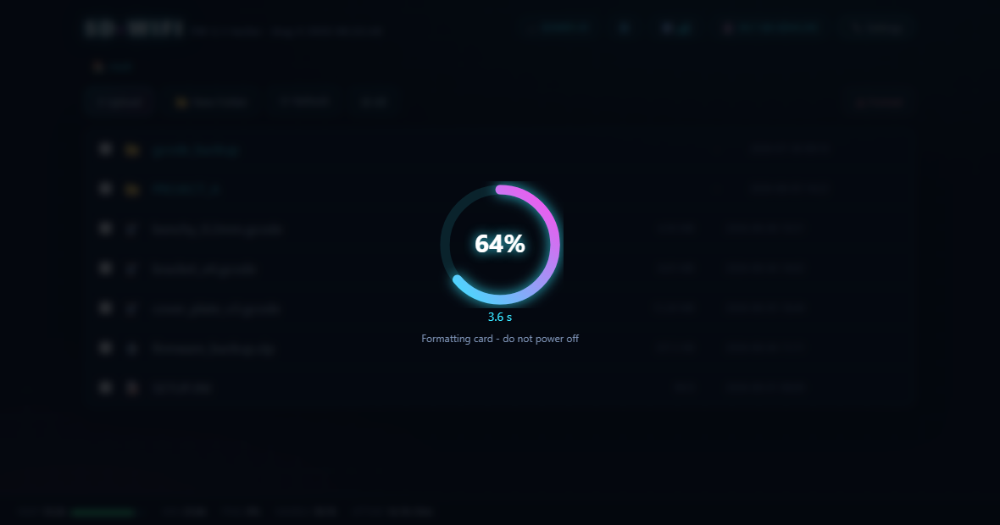

# SD-WIFI "Turbo" — optimized FYSETC ESPWebDAV firmware

Rework of the stock FYSETC firmware for the SD-WIFI board (rev 2.x, ESP-M2/ESP8285).
Fixes every known hang, is dramatically faster, and adds a neon web file manager.
Everything from stock still works: `SETUP.INI`, M50–M53 serial commands, 3D-printer bus sharing.





Drag-and-drop upload, download, rename, recursive folder delete, multi-select
with one-click bulk delete, live heap/uptime footer, WiFi signal bars — all
served from the board's own flash, no internet needed.

<table>
<tr>
<td width="50%"></td>
<td width="50%"></td>
</tr>
<tr>
<td>Settings: rename board, switch WiFi, set serial baud, flash new firmware
over the air, and read live flash/RAM stats.</td>
<td>Card format shows a real progress ring streamed from the board, with
elapsed time — no more guessing whether it hung.</td>
</tr>
</table>

## Stock bugs fixed (the lag / hang / crash causes)

| # | Symptom | Root cause in stock code |
|---|---------|--------------------------|
| 1 | **Permanent hang, power-cycle needed** | `while(!client.available()) delay(1);` — no timeout, no disconnect check. Windows keeps idle probe connections open; first one froze the board |
| 2 | **20-second dead boot every power-up** | unconditional `delay(20000)` waiting for a printer to claim the SPI bus |
| 3 | Random refusal to serve for ~20 s | CS_SENSE pin floating → WiFi noise fired the "printer is using the card" interrupt |
| 4 | Random reboots | LOCK handler wrote up to Content-Length bytes into a 1024-byte stack buffer (stack smash); big buffers on a 4 KB stack |
| 5 | Silently corrupted uploads | partial TCP reads were written as full 512-byte blocks — file offset drifted from stream |
| 6 | Card swap required reboot | one failed SD init disabled the server until power cycle |
| 7 | Rename with spaces produced `my%20file` | MOVE destination never url-decoded |
| 8 | WiFi drop never recovered | no auto-reconnect, stale connected flag |

## Speed work

- **Keep-alive connections** (stock closed TCP after every request; Explorer sends dozens per folder view)
- **160 MHz CPU** (was 80) + **lwIP v2 Higher Bandwidth** (MSS 1460)
- **WiFi modem-sleep off** (was the source of 100 ms+ latency spikes) + **TX power maxed at 20.5 dBm**
- **TCP_NODELAY** on all client sockets
- **4 KB sector-aligned SD transfers** (stock: 1460-byte unaligned reads that re-read sectors)
- **"Soft-DMA" double-buffered downloads** — the ESP8285 has no SPI DMA engine, so the
  4 KB buffer is split in half: while the TCP window is full (waiting for ACKs) the next
  SD chunk is prefetched, hiding SD read time inside network wait. Writes are sliced by
  `availableForWrite()` so they never block
- PROPFIND rebuilt: no SHA-1 per file, no String churn — one static buffer, one chunk per entry
- Zero malloc in hot paths, all big buffers static → no heap fragmentation over weeks of uptime

## Web UI (neon file manager)

Open `http://<board-ip>` (or `http://<name>.local` via mDNS) in any browser:

- Upload (button or **drag & drop**) with progress bar + live speed; no size cap
  beyond FAT32's 4 GB/file
- Download, **rename**, **delete** (folders delete recursively), **new folder**
- **Format card** with a live progress ring (real % streamed from the board) +
  elapsed time; ~30–60 s for a 32 GB card
- **Settings panel** (header button): board name, WiFi SSID/password + Connect
  (web version of M50/M51/M52), serial baud rate (applies live), **firmware
  update over WiFi** with pre-flash validation (magic byte + size, both sides),
  and system info (flash/RAM/heap/uptime)
- Distinct banners for "no SD card" vs "card in use by another host"
- Breadcrumbs, per-type icons, WiFi **signal bars**, card chip, live heap footer,
  FW version + build date/time
- Served from PROGMEM (~20 KB, +128 bytes RAM), zero external resources
- Status/settings/OTA keep working while a printer/USB reader owns the card
- JSON API for scripting: `GET /?api=status`, `GET /<dir>?api=list`,
  `POST /?api=format&confirm=FORMAT`, `POST /?api=name&v=NAME`,
  `POST /?api=wifi&ssid=S&pass=P`, `POST /?api=serial&baud=N`,
  `POST /?api=ota` (raw .bin body)

Settings (name, WiFi, baud) live in EEPROM — they **survive OTA updates** and
USB re-flashing (only a full chip erase or restoring a 1 MB dump clears them).

## Reliability hardening

- Non-blocking main loop — no code path can wait forever
- SD hot-remount: card swap / glitch recovers within 3 s, no reboot
- **Heap watchdog**: free heap < 4 KB for 10 s → clean self-restart (last-resort anti-wedge)
- Chunked uploads (macOS Finder) and `Expect: 100-continue` supported
- OTA updates (`ArduinoOTA`, password `fysetc`)

## Build

```bash
pio run                       # firmware at .pio/build/sdwifi/firmware.bin (copy in firmware/)
```

Pinned: espressif8266@4.2.1 (core 3.1.2), SdFat 1.1.4, `-D FS_NO_GLOBALS` (required),
board esp8285, DOUT, 1 MB, 160 MHz.
Arduino IDE also works: core 3.1.2 + SdFat 1.1.4, Generic ESP8285, 160 MHz, DOUT.

## Flash

**USB (first time):** switch to `USB2UART`, hold `FLSH` while plugging in, release, then:

```
flash.bat COM7
```

**OTA (after that):**

```bash
pio run -e sdwifi_ota -t upload --upload-port <board-ip>
```

**Back up stock firmware first** (on boards still running stock — for A/B benchmarks
or rollback): enter bootloader the same way, then:

```
backup_stock.bat COM7
```

## Benchmark

```powershell
.\bench.ps1 -Ip <board-ip> -Label stock    # before flashing turbo
.\bench.ps1 -Ip <board-ip> -Label turbo    # after
```

Measures PROPFIND latency (×20), 8 MB PUT/GET throughput, and a 15× small-file storm.

## SETUP.INI (all keys optional except SSID/PASSWORD)

```ini
SSID=mywifi
PASSWORD=mypass
NAME=SDWIFI-01          ; per-board hostname (10 boards = 10 names), also the OTA name
IP=192.168.1.51         ; static IP: faster join, stable address
GATEWAY=192.168.1.1
SUBNET=255.255.255.0
DNS=192.168.1.1
```

## Windows client tips (one-time, big effect)

1. Settings → Network → Proxy → turn **off** "Automatically detect settings" —
   with it on, Explorer probes for a proxy before nearly every WebDAV call.
2. For bulk transfers use WinSCP (WebDAV mode) or rclone — roughly 2× Explorer.

## Measured (board #1, PC and board both on WiFi)

- **Download (GET): ~1 MB/s** · **Upload (PUT): ~390-437 KB/s** · PROPFIND: ~60-108 ms
- Requires the **custom lwIP build** (see below). With the stock prebuilt lwIP
  the download caps at ~145 KB/s (`TCP_SND_BUF = 2×MSS` = 2.9 KB in flight).
- Heap during transfers: ~25 KB minimum, 2 % fragmentation - healthy margins.
- The ESP-M2 module on rev 2.1 actually carries a **2 MB** flash chip
  (`flashsize` reports 2097152) - a 2 MB layout with even more OTA headroom
  is possible later.

## Custom lwIP build (the ×16 download unlock)

The framework's prebuilt `liblwip2-1460-feat.a` hardcodes a 2-segment TCP send
buffer. We rebuild it with `TCP_SND_BUF = 16×MSS`, `TCP_WND = 6×MSS`:

- One-time (or after any PlatformIO framework update):
  run [tools/rebuild_lwip2.sh](tools/rebuild_lwip2.sh) inside WSL, then
  `pio run -t clean && pio run`.
- Shortcut: copy the prebuilt [tools/liblwip2-1460-feat-16xMSS.a](tools/liblwip2-1460-feat-16xMSS.a)
  over `~/.platformio/packages/framework-arduinoespressif8266/tools/sdk/lib/liblwip2-1460-feat.a`
  (a `.orig` backup of the stock lib is kept beside it after the script runs).

## Unchanged constraints

- Card must be FAT16/FAT32 (≤32 GB or reformat; 32 KB clusters fastest). No exFAT.
- `Cardreader` switch position hands the card to the PC (GL823K); the ESP backs off
  automatically (blockout now 10 s, boot observation 1 s instead of 20 s).
- Format button is a *quick* format of an existing FAT volume — brand-new or
  corrupted cards still need a full format on a PC.
